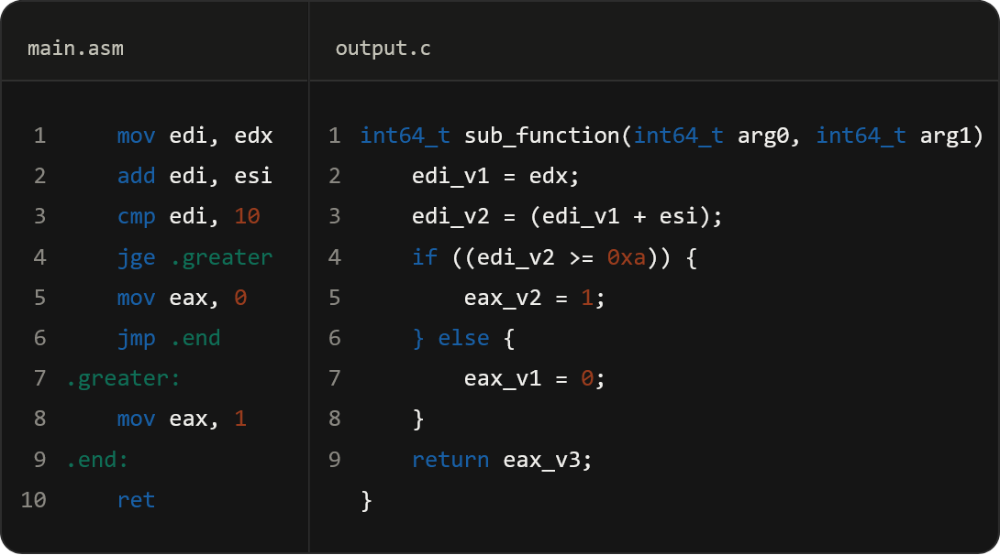

# ceddec

`ceddec` is a small & extremely lightweight x86/x86-64 disassembly-to-C decompiler pipeline, written in C++20.


DISCLAIMER: at&t is currently broken; it will be fixed in a future update

## Requirements

* Clang, on both Windows and Linux
* [Meson](https://mesonbuild.com/)
* [Ninja](https://ninja-build.org/)

## Building on Windows

### Option A: Visual Studio Build Tools

1. Install Python, then:

```
pip install meson ninja
```

2. Install Visual Studio Build Tools with the "C++ Clang tools for Windows" component, or via winget:

```
winget install Microsoft.VisualStudio.2022.BuildTools --override "--add Microsoft.VisualStudio.Component.VC.Llvm.Clang --add Microsoft.VisualStudio.Workload.VCTools"
```

3. Open the Developer PowerShell shortcut that comes with Build Tools. `clang-cl` and `lib.exe` both need to be on `PATH`, and a plain PowerShell or cmd window usually won't have either.
4. Build:

```
meson setup build --native-file build-cfg/windows-clang.ini
meson compile -C build
.\build\ceddec.exe
```

### Option B: standalone LLVM

1. Install LLVM, via winget:

```
winget install LLVM.LLVM
```

Make sure the LLVM `bin` directory ends up on `PATH`.

2. Install Meson and Ninja:

```
pip install meson ninja
```

3. Build:

```
meson setup build --native-file build-cfg/windows-clang.ini
meson compile -C build
.\build\ceddec.exe
```

If `meson setup` can't find Clang, check that `clang.exe`/`clang-cl.exe` actually resolve in your shell, and that `build-cfg/windows-clang.ini` matches your install.

## Building on Linux

### Arch / Manjaro / EndeavourOS / CachyOS

```
sudo pacman -S clang meson ninja
```

### Ubuntu / Debian / Linux Mint / Pop!_OS / Kali Linux

```
sudo apt update
sudo apt install clang meson ninja-build
```

### Fedora

```
sudo dnf install clang meson ninja-build
```

Then:

```
meson setup build --native-file build-cfg/linux-clang.ini
meson compile -C build
./build/ceddec
```

## What gets built

| Target | Type | Description |
|---|---|---|
| `ceddec_api` | shared library | The core library: parser, IR lifter, AST builder, emitters |
| `test1` | executable | Basic sanity-test binary (`tests/test1.cpp`) |
| `ceddec` | executable | Interactive CLI driver (`tests/ceddec.cpp`), shown above |

`test1` and `ceddec` are both optional and can be turned off if you only want the library:

```
meson setup build -Dtests=false -Dcli=false
```

## Compiling

```
meson setup build
meson compile -C build
```

Useful variants:

```
# static library instead of shared
meson setup build -Ddefault_library=static

# release build
meson setup build --buildtype=release

# skip the demo binaries, library only
meson setup build -Dtests=false -Dcli=false
```


## The pipeline, stage by stage

There are five stages. You can stop at any one of them if you don't need what comes after. 

```
assembly text -> Parser -> IRLifter -> (CalculateDominators/Frontiers, InsertPhiNodes, RenameVariables) -> ASTBuilder -> CEmitter -> C
```

### 1. Parse assembly text

```cpp
#include <ceddec/parser.hpp>

ceddec::ParserConfig cfg;
cfg.arch = ceddec::Architecture::x86_64;
cfg.intel_syntax = true;

ceddec::Parser parser = ceddec::CreateParser(cfg);

ceddec::ParsedBlock block = parser->ParseBlock(
    "mov eax, edi\n"
    "add eax, esi\n"
    "ret\n"
);

for (const auto& inst : block.instructions) {
    // inst.mnemonic, inst.operands, inst.condition, inst.is_valid, ...
}
```

`ParseLine` is available too, if you're feeding it one instruction at a time rather than a whole block. 
`ParsedInstruction::is_valid` tells you whether a line was understood; 
with `strict_mode` enabled, `ParseLine`/`ParseBlock` throw `std::runtime_error` on unknown structures instead of silently skipping them.

AT&T syntax works the same way, just flip the config flag:

```cpp
ceddec::ParserConfig att_cfg;
att_cfg.intel_syntax = false;

auto att_parser = ceddec::CreateParser(att_cfg);
auto att_block = att_parser->ParseBlock(
    "movl %edi, %eax\n"
    "addl %esi, %eax\n"
    "retq\n"
);
// operands come back destination-first regardless of syntax:
// ceddec normalizes AT&T's src...,dst ordering to match Intel's dst, src
```

### 2. Lift to IR and build a CFG

```cpp
#include <ceddec/ir.hpp>

ceddec::ControlFlowGraph cfg_graph = ceddec::IRLifter::BuildCFG(block.instructions);

ceddec::IRLifter::CalculateDominators(cfg_graph);
ceddec::IRLifter::CalculateDominanceFrontiers(cfg_graph);
ceddec::IRLifter::InsertPhiNodes(cfg_graph);
ceddec::IRLifter::RenameVariables(cfg_graph);   // full SSA renaming, one version per definition
```

For a single basic block with no branches, full dominance-frontier SSA is overkill, so use the cheaper local pass instead:

```cpp
// straight-line code, e.g. a leaf function body with no jumps:
ceddec::ControlFlowGraph leaf_cfg = ceddec::IRLifter::BuildCFG(block.instructions);
ceddec::IRLifter::ApplyLocalSSA(leaf_cfg);
```

`LiftInstruction` is exposed separately too, in case you want to lift a single `ParsedInstruction` into its `IRInstruction` sequence without building a graph at all. Handy for unit tests or one-off inspection:

```cpp
ceddec::ParsedInstruction one = parser->ParseLine("xor eax, eax");
std::vector<ceddec::IRInstruction> ir = ceddec::IRLifter::LiftInstruction(one);
```

### 3. Inspect the IR (optional)

```cpp
#include <ceddec/printer.hpp>

ceddec::PrintParsedBlock("my block", block);
ceddec::PrintCFGAnalysis(cfg_graph);
```

`PrintParsedBlock` dumps each instruction's mnemonic and operand kinds. `PrintCFGAnalysis` dumps the full picture per basic block: predecessors, dominators, immediate dominator, dominance frontier, and the SSA-renamed instructions (including phi nodes) inside it. Both are plain stdout dumps meant for debugging the pipeline itself, not for shipping to end users.

### 4. Recover a function signature (optional)

```cpp
#include <ceddec/calling_conv.hpp>

ceddec::FunctionSignature sig = ceddec::AnalyzeCallingConvention(cfg_graph);
// sig.name        -> "sub_function" (default; nothing recovers real names yet)
// sig.return_type -> "int64_t"
// sig.params      -> populated based on which System V arg registers are touched
```

This is a deliberately lightweight System V AMD64 argument scan: it currently checks for `EDI`/`RDI` and `ESI`/`RSI` usage anywhere in the CFG and, if found, adds a matching `int64_t argN` to `sig.params`. It's a heuristic, not a real ABI/liveness analysis: good enough to get plausible-looking headers on simple functions, not a substitute for actual argument-count recovery.

### 5. Build an AST and emit C

```cpp
#include <ceddec/ast.hpp>
#include <ceddec/emitters/c.hpp>
#include <ceddec/formatter.hpp>

auto ast = ceddec::ASTBuilder::BuildAST(cfg_graph);

ceddec::CEmitter emitter;
std::string header = ceddec::FormatFunctionHeader(sig);   // "sub_function(int64_t arg0, int64_t arg1)"
std::string body   = emitter.EmitFunction(sig.name, sig.return_type, *ast);

std::cout << body;
```

`ASTBuilder::BuildAST` structures the SSA'd CFG back into `if`/`else` and loop shapes where it can detect them, falling back to a flat block of statements otherwise. `CEmitter` derives from a generic `BaseEmitter` visitor (`ASTVisitor`), so an emitter for a different target language is just a matter of implementing the same eleven `visit()` overloads, no changes needed anywhere else in the pipeline.

## Putting it all together

```cpp
#include <ceddec/parser.hpp>
#include <ceddec/ir.hpp>
#include <ceddec/ast.hpp>
#include <ceddec/calling_conv.hpp>
#include <ceddec/emitters/c.hpp>

std::string Decompile(std::string_view asm_text) {
    auto parser = ceddec::CreateParser();
    auto block  = parser->ParseBlock(asm_text);

    auto cfg = ceddec::IRLifter::BuildCFG(block.instructions);
    ceddec::IRLifter::CalculateDominators(cfg);
    ceddec::IRLifter::CalculateDominanceFrontiers(cfg);
    ceddec::IRLifter::InsertPhiNodes(cfg);
    ceddec::IRLifter::RenameVariables(cfg);

    auto sig = ceddec::AnalyzeCallingConvention(cfg);
    auto ast = ceddec::ASTBuilder::BuildAST(cfg);

    ceddec::CEmitter emitter;
    return emitter.EmitFunction(sig.name, sig.return_type, *ast);
}
```

This is essentially what `tests/ceddec.cpp` does under the hood for the interactive CLI shown at the top of this README: parse into a block, lift and SSA-rename the CFG, structure it into an AST, recover a best-guess signature, and emit C.

## More examples

A handful of smaller, focused snippets that show off individual corners of the API. Useful if you're integrating just one piece rather than the whole pipeline.

**Strict-mode parsing, for catching bad input early**

```cpp
ceddec::ParserConfig strict_cfg;
strict_cfg.strict_mode = true;
auto strict_parser = ceddec::CreateParser(strict_cfg);

try {
    strict_parser->ParseLine("frobnicate eax, ebx");   // not a real instruction
} catch (const std::runtime_error& e) {
    // "ceddec: failed to parse instruction: \"frobnicate eax, ebx\""
}
```

**Treating bare immediates as hex by default**

Some disassemblers emit raw offsets without a `0x` prefix. `default_hex_immediates` tells the parser to assume hex when there's no explicit base:

```cpp
ceddec::ParserConfig cfg;
cfg.default_hex_immediates = true;
auto parser = ceddec::CreateParser(cfg);

auto instr = parser->ParseLine("cmp eax, 1f");   // parsed as 0x1f, not decimal 1 (which would fail)
```

**Checking whether a line was actually understood**

```cpp
auto block = parser->ParseBlock(raw_disassembly);
size_t skipped = 0;
for (auto& line_text : SplitLines(raw_disassembly)) {
    if (!parser->ParseLine(line_text).is_valid) skipped++;
}
```

(`ParseBlock` silently drops invalid lines from `block.instructions` in non-strict mode, so counting drops this way is often the simplest sanity check before trusting a large block.)

**Lifting one instruction to see its opcode/operand shape**

```cpp
auto add_ir = ceddec::IRLifter::LiftInstruction(parser->ParseLine("add eax, 5"));
// add_ir[0].opcode == ceddec::IROpcode::Add
// add_ir[0].destination -> Register::EAX
// add_ir[0].source      -> int64_t(5)
```

**Local SSA for a straight-line snippet (no CFG analysis needed)**

```cpp
auto snippet = parser->ParseBlock("mov eax, 1\nadd eax, eax\nadd eax, eax\n");
auto cfg = ceddec::IRLifter::BuildCFG(snippet.instructions);
ceddec::IRLifter::ApplyLocalSSA(cfg);
// each redefinition of eax gets a fresh ssa_version within the single block,
// no dominator/phi-node machinery spun up for code that never branches
```

**Full SSA on a branching CFG, then reading back the phi nodes**

```cpp
ceddec::IRLifter::CalculateDominators(cfg_graph);
ceddec::IRLifter::CalculateDominanceFrontiers(cfg_graph);
ceddec::IRLifter::InsertPhiNodes(cfg_graph);
ceddec::IRLifter::RenameVariables(cfg_graph);

for (auto& blk : cfg_graph.blocks) {
    for (auto& inst : blk.instructions) {
        if (inst.opcode == ceddec::IROpcode::Phi) {
            // inst.destination is the merged SSA value;
            // inst.phi_sources holds one IROperand per incoming predecessor
        }
    }
}
```

**Walking dominator info directly, without the printer**

```cpp
ceddec::IRLifter::CalculateDominators(cfg_graph);
ceddec::IRLifter::CalculateDominanceFrontiers(cfg_graph);

for (auto& blk : cfg_graph.blocks) {
    if (blk.idom != static_cast<size_t>(-1)) {
        // blk.idom is this block's immediate dominator
    }
    // blk.dominators, blk.dom_frontier, blk.predecessors are all populated too
}
```

**Writing a custom emitter by reusing `BaseEmitter`**

Because `CEmitter` just implements `ASTVisitor` on top of `BaseEmitter`'s indent/output bookkeeping, targeting a new language is mostly a matter of writing your own `visit()` overloads:

```cpp
#include <ceddec/emitters/base.hpp>
#include <ceddec/ast.hpp>

class PseudoPythonEmitter : public ceddec::BaseEmitter, public ceddec::ASTVisitor {
public:
    PseudoPythonEmitter() : BaseEmitter(4) {}

    void visit(ceddec::ASTAssignmentStmt& node) override {
        out_ << Indent() << EmitExpr(*node.target) << " = " << EmitExpr(*node.expression) << "\n";
    }
    void visit(ceddec::ASTIfElseStmt& node) override {
        out_ << Indent() << "if " << EmitExpr(*node.condition) << ":\n";
        PushIndent();
        if (node.then_branch) node.then_branch->accept(*this);
        PopIndent();
    }
    // ... remaining visit() overloads for the other nine node types
};
```

**Formatting just the header, independent of emitting a body**

Handy if you're generating a header file or a function prototype list and don't need the decompiled body at all:

```cpp
ceddec::FunctionSignature sig;
sig.name = "process_packet";
sig.return_type = "int64_t";
sig.params = {"int64_t arg0", "int64_t arg1"};

std::string proto = ceddec::FormatFunctionHeader(sig);
// "process_packet(int64_t arg0, int64_t arg1)"
```

**Debugging a suspicious CFG before trusting the AST it produces**

```cpp
auto cfg = ceddec::IRLifter::BuildCFG(block.instructions);
ceddec::IRLifter::CalculateDominators(cfg);
ceddec::IRLifter::CalculateDominanceFrontiers(cfg);
ceddec::IRLifter::InsertPhiNodes(cfg);
ceddec::IRLifter::RenameVariables(cfg);

ceddec::PrintCFGAnalysis(cfg);   // eyeball dominators/phi nodes before calling ASTBuilder::BuildAST
auto ast = ceddec::ASTBuilder::BuildAST(cfg);
```

## Notes

* All public API symbols are marked `CEDDEC_API` for correct DLL export/visibility on both Windows and Linux. 
* You don't need to do anything special to consume them from another shared library or executable.
* `types.hpp` defines the shared vocabulary (`Register`, `IROpcode`, `ConditionCode`, `ParsedInstruction`, `IRInstruction`, `ControlFlowGraph`, etc.) used across every stage. Worth skimming first if you're extending the pipeline rather than just consuming it.
* Internals under `source/misc/` (opcode-to-`IROpcode` mapping, register name parsing/printing) are implementation detail, not part of the public interface, and may change without notice.
* `AnalyzeCallingConvention` and `ASTBuilder`'s CFG structuring are both heuristic-based. They aim for readable output on typical compiler-generated code, not bit-for-bit ABI accuracy on adversarial or hand-written assembly.

## License
ceddec is Licensed under CSAL
